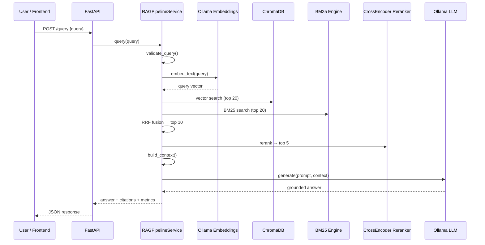

# RAG System — Architecture & Operations Guide

A production-grade **Retrieval-Augmented Generation (RAG)** pipeline built with **Clean Architecture** principles. The system ingests documents, indexes them in a vector database, retrieves relevant context using hybrid search, and generates grounded answers with traceable citations.

---

## Table of Contents

1. [High-Level Overview](#1-high-level-overview)
2. [Technology Stack](#2-technology-stack)
3. [Models Used (Current Configuration)](#3-models-used-current-configuration)
4. [End-to-End Flows](#4-end-to-end-flows)
5. [Architecture Layers & Components](#5-architecture-layers--components)
6. [Retrieval Approach](#6-retrieval-approach)
7. [Configuration Reference](#7-configuration-reference)
8. [Setup & Run Guide](#8-setup--run-guide)
9. [API & Frontend](#9-api--frontend)
10. [Project Structure](#10-project-structure)
11. [Switching Providers](#11-switching-providers)

---

## 1. High-Level Overview

```
┌─────────────┐     ┌──────────────┐     ┌─────────────────┐     ┌──────────────┐
│  Documents  │────▶│   Ingestion  │────▶│ Chunk + Embed   │────▶│  ChromaDB    │
│ PDF/DOCX/TXT│     │   Loaders    │     │ (Ollama embed)  │     │ Vector Store │
└─────────────┘     └──────────────┘     └─────────────────┘     └──────┬───────┘
                                                                        │
┌─────────────┐     ┌──────────────┐     ┌─────────────────┐           │
│   User UI   │────▶│  FastAPI     │────▶│ Hybrid Retrieval│◀──────────┘
│  / Frontend │     │  /query      │     │ Vector + BM25   │
└─────────────┘     └──────┬───────┘     └────────┬────────┘
                           │                      │
                           │              ┌───────▼────────┐
                           │              │ Cross-Encoder  │
                           │              │   Reranker     │
                           │              └───────┬────────┘
                           │                      │
                           │              ┌───────▼────────┐
                           └─────────────▶│ Ollama LLM     │
                                          │ (Grounded Gen) │
                                          └────────────────┘
```

**Design principles:**
- **Modular layers** — each concern (ingestion, chunking, embeddings, storage, retrieval, LLM) is swappable via config.
- **Grounded generation** — the LLM is instructed to answer only from retrieved context and cite sources.
- **Hybrid retrieval** — dense vector search + sparse BM25 keyword search, fused with Reciprocal Rank Fusion (RRF).
- **Local-first** — embeddings and LLM run via **Ollama** on your machine; no cloud dependency required.

---

## 2. Technology Stack

| Layer | Technology | Purpose |
|-------|------------|---------|
| **API** | FastAPI + Uvicorn | REST endpoints, OpenAPI docs, CORS |
| **Frontend** | HTML / CSS / JavaScript | Chat UI at `http://localhost:8000/` |
| **Config** | Pydantic Settings + `.env` | Environment-based provider selection |
| **Embeddings** | Ollama (`nomic-embed-text`) | Local vector generation (768-dim) |
| **LLM** | Ollama (`llama3.1:8b`) | Local grounded answer generation |
| **Vector DB** | ChromaDB (persistent) | Cosine similarity search, disk persistence |
| **Keyword Search** | rank-bm25 (BM25Okapi) | Sparse lexical retrieval |
| **Reranker** | sentence-transformers CrossEncoder | `cross-encoder/ms-marco-MiniLM-L-6-v2` |
| **Document Parsing** | pypdf, python-docx, httpx | PDF, DOCX, TXT, HTML, web URLs |
| **Logging** | Structured JSON logs | Query telemetry, latency breakdown |
| **Testing** | pytest | Unit/integration tests (mock providers in CI) |

**Python dependencies:** see `requirements.txt`

---

## 3. Models Used (Current Configuration)

These are the **active models** when using the default `.env`:

| Role | Provider | Model | Notes |
|------|----------|-------|-------|
| **Embeddings** | Ollama | `nomic-embed-text` | 768-dimensional vectors; optimized for retrieval |
| **LLM (generation)** | Ollama | `llama3.1:8b` | Local 8B instruct model; temperature=0 for factual answers |
| **Reranker** | sentence-transformers | `cross-encoder/ms-marco-MiniLM-L-6-v2` | Re-scores query–passage pairs |
| **Chunking** | Header-aware | — | Splits on Markdown headers, Parts, Case Studies |
| **Vector index** | ChromaDB | HNSW (cosine) | Persisted at `./my_chroma_db` |

### Optional cloud alternatives (not active by default)

| Role | Provider | Model |
|------|----------|-------|
| LLM | NVIDIA NIM | `meta/llama-3.1-8b-instruct` |
| LLM | OpenAI | `gpt-4o-mini` |
| LLM | Gemini | `gemini-1.5-flash` |
| Embeddings | OpenAI | `text-embedding-3-small` |
| Embeddings | SentenceTransformers | `BAAI/bge-small-en-v1.5` |

> **Important:** If you change the embedding model, you must **reset and re-ingest** all documents (`python scripts/reset_and_ingest.py`). Vector dimensions must match between ingest and query.

---

## 4. End-to-End Flows

### 4.1 Ingestion Flow

```
Source file/URL
      │
      ▼
┌─────────────────┐
│ Document Loader │  PDF / DOCX / TXT / HTML / Web
└────────┬────────┘
         │  Raw text + metadata (title, source, author)
         ▼
┌─────────────────┐
│ Header-Aware    │  Split on # headers, Part N, Case Study N
│ Chunker         │  Preserves section hierarchy in metadata
└────────┬────────┘
         │  List of Document chunks
         ▼
┌─────────────────┐
│ Ollama Embed    │  POST /api/embed  (nomic-embed-text)
└────────┬────────┘
         │  768-dim vectors
         ▼
┌─────────────────┐
│ ChromaDB        │  Store vectors + metadata + content
└────────┬────────┘
         │
         ▼
┌─────────────────┐
│ BM25 Index      │  In-memory keyword index (rehydrated on restart)
└─────────────────┘
```

**Script:** `python scripts/ingest_temp_doc.py`  
**API:** `POST /ingest` with `{"source": "Docs/myfile.pdf"}`

### 4.2 Query Flow

```
User question
      │
      ▼
┌─────────────────┐
│ Input Validator │  Prompt injection detection, sanitization
└────────┬────────┘
         │
         ▼
┌─────────────────────────────────────────┐
│ Hybrid Retrieval                        │
│  ├─ Vector search (Ollama embed query)  │  top_k × 2 candidates
│  └─ BM25 keyword search                 │
│  └─ RRF fusion → top_k results          │
└────────┬────────────────────────────────┘
         │
         ▼
┌─────────────────┐
│ Cross-Encoder   │  Rerank to top_m passages
│ Reranker        │
└────────┬────────┘
         │
         ▼
┌─────────────────┐
│ Context Builder │  Deduplicate, sort by section, token budget (~4000)
└────────┬────────┘
         │  Formatted context + citation list
         ▼
┌─────────────────┐
│ Ollama LLM      │  System prompt: answer only from context
│ (llama3.1:8b)   │  Cite sources; refuse to hallucinate
└────────┬────────┘
         │
         ▼
Answer + citations + latency metrics
```

**Script:** `python scripts/run_benchmark.py`  
**API:** `POST /query` with `{"query": "your question"}`  
**UI:** `http://localhost:8000/`

### 4.3 Sequence Diagram (Query)



---

## 5. Architecture Layers & Components

### 5.1 Configuration (`config/`)

| File | Responsibility |
|------|----------------|
| `settings.py` | All env vars: providers, models, chunk sizes, retrieval params |
| `logging_config.py` | JSON structured logging |

### 5.2 Ingestion (`src/ingestion/`)

| Loader | Formats |
|--------|---------|
| `TextDocumentLoader` | `.txt`, `.md` |
| `PDFDocumentLoader` | `.pdf` (pypdf) |
| `DocxDocumentLoader` | `.docx` |
| `HTMLDocumentLoader` | `.html`, `.htm` |
| `WebPageLoader` | HTTP/HTTPS URLs |

Each loader returns `Document` objects with rich `ChunkMetadata` (title, source, author, section, RBAC roles).

### 5.3 Chunking (`src/chunking/`)

| Strategy | Class | When to use |
|----------|-------|-------------|
| **header** (default) | `HeaderAwareChunker` | Structured docs with headings, parts, case studies |
| recursive | `RecursiveCharacterChunker` | General text; splits by paragraph → sentence |
| semantic | `SemanticChunker` | Sentence-boundary chunks up to `CHUNK_SIZE` |
| fixed | `FixedSizeChunker` | Fixed character windows with overlap |

Config: `CHUNKING_STRATEGY=header`, `CHUNK_SIZE=500`, `CHUNK_OVERLAP=100`

### 5.4 Embeddings (`src/embeddings/`)

| Provider | Config value | Runtime |
|----------|--------------|---------|
| **Ollama** (default) | `ollama` | Local HTTP API |
| SentenceTransformers | `sentence_transformers` | Local HuggingFace model |
| OpenAI | `openai` | Cloud API |

**Active:** `OllamaEmbeddingProvider` → `POST http://localhost:11434/api/embed`

### 5.5 Vector Store (`src/vector_store/`)

| Provider | Config value | Persistence |
|----------|--------------|-------------|
| **ChromaDB** (default) | `chroma` | `./my_chroma_db/` |
| Memory | `memory` | JSON file (dev/test) |
| Qdrant / FAISS | `qdrant` / `faiss` | Stub wrappers |

Chroma uses **cosine similarity** (HNSW index). On startup, all chunks are loaded back into the BM25 index automatically.

### 5.6 Retrieval (`src/retrieval/`)

| Engine | Method |
|--------|--------|
| `VectorSearchEngine` | Embed query → Chroma cosine search |
| `BM25SearchEngine` | Tokenize + BM25Okapi scoring |
| `HybridSearchEngine` | RRF fusion of both result lists |

Security: `RBACEngine` filters chunks by `allowed_roles` metadata.

### 5.7 Reranking (`src/reranking/`)

| Provider | Config value | Model |
|----------|--------------|-------|
| **CrossEncoder** (default) | `cross_encoder` | `ms-marco-MiniLM-L-6-v2` |
| Identity | `identity` | Pass-through (no reranking) |

### 5.8 Context & Citations (`src/context/`)

- **ContextBuilder** — deduplicates chunks, sorts by document/section, enforces ~4000 token budget.
- **CitationFormatter** — produces markdown citation blocks with chunk IDs and section names.

### 5.9 LLM (`src/llm/`)

| Provider | Config value | Endpoint |
|----------|--------------|----------|
| **Ollama** (default) | `ollama` | `POST /api/chat` |
| NVIDIA NIM | `nvidia_nim` | OpenAI-compatible cloud API |
| OpenAI | `openai` | `chat/completions` |
| Gemini | `gemini` | Google Generative Language API |

**System prompt (all providers):**
> Answer only using the provided context. If the answer cannot be found, say so explicitly. Do not fabricate information. Always cite sources.

Mock providers exist **only for pytest** — they are not used in production defaults.

### 5.10 Security (`src/security/`)

- **InputValidator** — detects prompt injection patterns in user queries.
- **RBACEngine** — metadata-based document access control (`allowed_roles`).

### 5.11 Evaluation (`src/evaluation/`)

Metrics computed per query:
- Retrieval Precision / Recall
- Context Relevance
- Faithfulness
- Hallucination Rate

### 5.12 Orchestrator (`src/service.py`)

`RAGPipelineService` wires all layers together. It is a singleton injected into FastAPI routes via `get_rag_service()`.

---

## 6. Retrieval Approach

### Why Hybrid Search?

| Method | Strength | Weakness |
|--------|----------|----------|
| **Dense (vector)** | Semantic similarity, paraphrases | Misses exact keyword matches |
| **Sparse (BM25)** | Exact term matching, rare words | No semantic understanding |

**Solution:** Run both, then fuse rankings with **Reciprocal Rank Fusion (RRF)**:

```
RRF_score(doc) = Σ  1 / (k + rank_i)
                 i ∈ {vector, bm25}
```

Default `k = 60` (`RRF_K` in settings).

### Why Reranking?

Initial retrieval returns ~10 candidates. A **CrossEncoder** scores each `(query, passage)` pair jointly, producing more accurate relevance than bi-encoder cosine similarity alone. Top 5 reranked passages are sent to the LLM.

### Why Header-Aware Chunking?

Documents like the Rishi Cognitive Framework have clear structure (Parts, Case Studies). Header-aware chunking:
- Keeps related content together
- Preserves `section` metadata for citations
- Improves retrieval when users ask about named sections

---

## 7. Configuration Reference

All settings live in `.env` (loaded by `config/settings.py`):

```env
# Vector store
VECTOR_DB_PATH=./my_chroma_db
VECTOR_STORE_PROVIDER=chroma

# Local Ollama (production defaults)
EMBEDDING_PROVIDER=ollama
LLM_PROVIDER=ollama
RERANKER_PROVIDER=cross_encoder
CHUNKING_STRATEGY=header

OLLAMA_BASE_URL=http://localhost:11434
OLLAMA_EMBEDDING_MODEL=nomic-embed-text
OLLAMA_LLM_MODEL=llama3.1:8b

# Retrieval tuning
TOP_K_RETRIEVAL=10
TOP_K_RERANK=5
HYBRID_ALPHA=0.5
RRF_K=60
CHUNK_SIZE=500
CHUNK_OVERLAP=100
```

---

## 8. Setup & Run Guide

### Prerequisites

1. **Python 3.11+** with venv activated
2. **Ollama** installed and running → [https://ollama.com](https://ollama.com)
3. Dependencies installed: `pip install -r requirements.txt`

### Step 1 — Pull Ollama models

```bash
ollama pull nomic-embed-text
ollama pull llama3.1:8b
```

Verify:
```bash
python scripts/check_ollama.py
```

### Step 2 — Reset & ingest documents

Required after switching from mock embeddings to Ollama:

```bash
python scripts/reset_and_ingest.py
```

Or ingest only (if index is empty):
```bash
python scripts/ingest_temp_doc.py
```

### Step 3 — Start API + frontend

```bash
uvicorn src.api.app:app --host 0.0.0.0 --port 8000 --reload
```

Open **http://localhost:8000/** for the chat UI.

### Step 4 — Run benchmark (optional)

```bash
python scripts/run_benchmark.py
```

### Step 5 — Run tests

```bash
pytest tests/
```

Tests force mock providers via `tests/conftest.py` so they run without Ollama.

---

## 9. API & Frontend

### REST Endpoints

| Method | Path | Description |
|--------|------|-------------|
| `GET` | `/` | Chat frontend |
| `GET` | `/health` | Provider status, vector count, Ollama connectivity |
| `GET` | `/metrics` | Query counters and average latency |
| `POST` | `/ingest` | Ingest a file or URL |
| `POST` | `/query` | Ask a grounded question |
| `POST` | `/evaluate` | Run RAG quality metrics |
| `GET` | `/docs` | Swagger UI |

### Example query

```powershell
Invoke-RestMethod -Method POST -Uri "http://localhost:8000/query" `
  -ContentType "application/json" `
  -Body '{"query": "What are the four mental muscles?"}'
```

### Frontend

Single-page chat at `/` with:
- Suggested starter questions
- Expandable source citations
- Model name and latency display
- Provider status badge from `/health`

---

## 10. Project Structure

```
RAG/
├── config/
│   ├── settings.py              # Pydantic env configuration
│   └── logging_config.py        # JSON logging
├── frontend/
│   └── index.html               # Chat UI
├── scripts/
│   ├── check_ollama.py          # Verify Ollama + models
│   ├── ingest_temp_doc.py       # Ingest Temp-Doc sample
│   ├── reset_and_ingest.py      # Clear Chroma + re-ingest
│   └── run_benchmark.py         # Evaluation benchmark
├── src/
│   ├── api/                     # FastAPI routes
│   ├── chunking/                # Chunking strategies
│   ├── context/                 # Context builder + citations
│   ├── embeddings/              # Ollama, OpenAI, SentenceTransformers
│   ├── evaluation/              # RAG metrics
│   ├── ingestion/               # Document loaders
│   ├── llm/                     # Ollama, NVIDIA, OpenAI, Gemini
│   ├── metadata/                # Document & chunk schemas
│   ├── monitoring/              # Telemetry + metrics
│   ├── reranking/               # CrossEncoder reranker
│   ├── retrieval/               # Vector, BM25, Hybrid RRF
│   ├── security/                # RBAC + input validation
│   ├── utils/                   # Ollama health check
│   ├── vector_store/            # ChromaDB implementation
│   └── service.py               # Central RAG orchestrator
├── tests/                       # pytest suite
├── Temp-Doc/                    # Sample knowledge base
├── my_chroma_db/                # Chroma persistence (gitignore)
├── .env                         # Active configuration
├── requirements.txt
└── ARCHITECTURE.md              # This document
```

---

## 11. Switching Providers

| Goal | Change in `.env` | Extra step |
|------|------------------|------------|
| Use cloud LLM (NVIDIA) | `LLM_PROVIDER=nvidia_nim` + `NVIDIA_API_KEY` | Restart API |
| Use OpenAI embeddings | `EMBEDDING_PROVIDER=openai` + key | **Re-ingest all docs** |
| Faster reranking off | `RERANKER_PROVIDER=identity` | Restart API |
| Different chunking | `CHUNKING_STRATEGY=recursive` | Re-ingest recommended |
| Different Ollama model | Change `OLLAMA_LLM_MODEL` | `ollama pull <model>` |

**Rule:** Any change to the **embedding model** requires `python scripts/reset_and_ingest.py`.

---

## Quick Reference Card

```
Setup:     ollama pull nomic-embed-text && ollama pull llama3.1:8b
Check:     python scripts/check_ollama.py
Ingest:    python scripts/reset_and_ingest.py
Serve:     uvicorn src.api.app:app --host 0.0.0.0 --port 8000 --reload
Chat:      http://localhost:8000/
Docs:      http://localhost:8000/docs
Test:      pytest tests/
```
